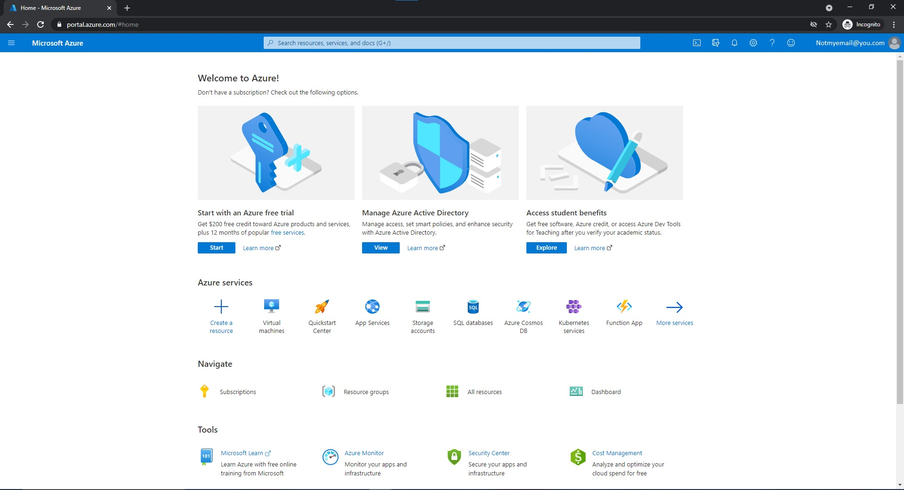
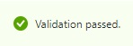
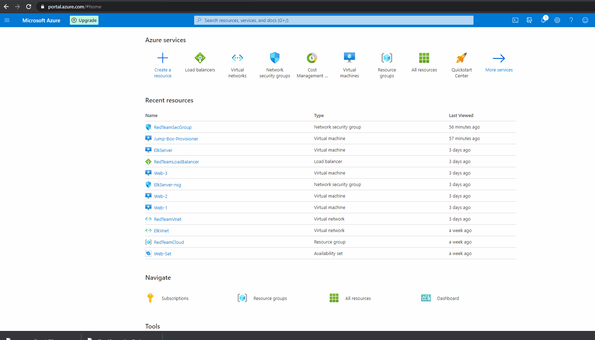
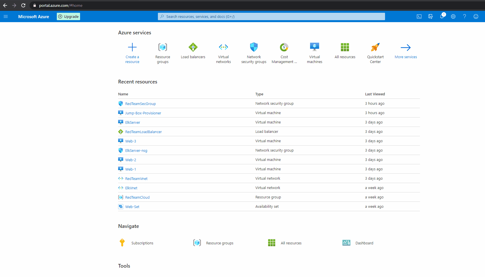

## GT_Cloud_Computing_Documentation Homework
### Georgia Tech Cyber Security Cloud Network Diagram and Documentation Homework

# Getting Started with Cloud Computing  

#### Cloud Computing is becoming more and more of a necessary tool set for many companies, Cloud Computing has opened many gates to make more resources readily available and more accessible then ever before. Along with these it has also opened more attack vectors for criminals and other hacktivist groups, while cloud computing is a revolutionary idea you must weight your risks and accurately judge the added risks that come with it. All the major Cloud Computing companies such as Azure, Google, and Amazon come with the basic toolsets to help harden and protect your systems if used correctly and managed thoroughly. In this documentation I will run you through the basics of cloud computing in a Microsoft Azure cloud environment, and some ways on how to help prevent attacks against your cloud VMs with basic cloud security.  

---  
  

  
### The cloud isn’t anything new either it has been around for a long time, it has just become more viable in the past decade with the ease of use and configuration. Now anyone can easily utilize cloud computing in todays era.  
  
>“Cloud computing is really a no-brainer for any start-up because it allows you to test your business plan very quickly for little money. Every start-up, or even a division within a company that has an idea for something new, should be figuring out how to use cloud computing in its plan.” –Brad Jefferson, Animoto CEO. 2009.  

---  

## Prerequisites
1.	Understanding of basic computer systems (How to operate and use a machine, firewall basics (Allow/Deny rule sets))
2.	An Azure account & payment plan if you wish to follow along during the deployment(s)
3.	You can use almost any type of unix based terminal emulator if you are on a windows system, my favorite is: [GitBash]( https://git-scm.com/downloads) which comes as a separate download with the Git scm client, simply click to install GitBash when prompted through the Git Install. [Install Guide](https://www.educative.io/edpresso/how-to-install-git-bash-in-windows)
4.	A solid network connection is required since everything we will be doing is over the network via HTTP and SSH protocalls (We will go over these in later examples)
5. Terminology
	- VM - Virtual Machine
	- VNet - Virtual Network
	- VPN - Virtual Private Network
	- NSG Network Security Group
	
---

# Step 1 Cloud Setup   

## *In these steps we will be creating our resources and configuring them after we have everything created and running in [Step 2 Cloud Configuration](#Step2)*

#### First Things first, double check you have an azure account with a payment option selected that allows your to add resources to your Azure Portal located here: [Go to your Azure Portal ??](https://portal.azure.com/). If you can see this:
 
then you are good to go!  

### Adding a Resource Group  

- We are going to add a resource group to house our VMs and other resources that our VMs need for our first deployments.
- Under the [Home Portal](https://portal.azure.com/#home) first click on the *Resource groups* button if you do not see it in the top like mine you can click on top search bar that reads: *Search resources, services, and docs (G+/)* and start typing in *Resource groups* and it will pop up.
- Next Click on  to add a new resource group
- Now enter the name of the of your resouce group in the Resource group section
- Finally Select your Region you will be deploying do, since I live in Alabama and targeting the east region I will select (US) East US as my region.
- Click on  to review your new region group
- If everything has worked correctly you will see  then you are ready to click the  button
- You can validate everything has worked correctly with the Resource Group Created Successfully popup that will be prompted afterwards
- Gif Tutorial 

### Adding a Network Security Group  

- To make a new NSG first head to the [Home Portal](https://portal.azure.com/#home) click on the *Network security groups* button if you do not see it in the top like mine you can click on top search bar that reads: *Search resources, services, and docs (G+/)* and start typing in *Network security groups* and it will pop up.
- Next Click on  to add a new resource group
- Now select your Resource Group you've just created so it will be housed under that specific group, which will make it easier to find to manage later incase you make multiple NSGs
- Now enter the name of the of your resouce group in the Resource group section
- Select the same region you selected for your resource group
- Click on  to review your new region group
- If everything has worked correctly you will see  then you are ready to click the  button
- You can validate everything has worked correctly with the Resource Group Created Successfully popup that will be prompted afterwards
- Gif Tutorial 	

### Adding a Virtual Network  

- We will be creating a virtual network for our machines to be able to communicate through, this will be a VPN (Virtual Private Network). This means that only the machines on that network will be able to talk to each other because of the way we have configured our NSGs to only allow internal traffic between VMs
- First from [Home Portal](https://portal.azure.com/#home) select *Virtual network*

### Adding a Virtual Machine  

- The first machine we are going to make will be a jumpbox machine that we will utilize as the administrator machine, this will be a close off machine that will allow only us to access the other VMs inside of our virtual need
- To make a new VM first start from [Home Portal](https://portal.azure.com/#home) and click on the *Virtual machines* button if you do not see it in the top like mine you can click on top search bar that reads: *Search resources, services, and docs (G+/)* and start typing in *Virtual machines* and it will pop up.
- Next Click on  to add a new resource group
- Now select your Resource Group you've just created so it will be housed under that specific group, which will make it easier to find to manage later incase you make multiple NSGs
- Now enter the name of the of your resouce group in the Resource group section
- Select the same region you selected for your resource group
- Click on  to review your new region group
- If everything has worked correctly you will see  then you are ready to click the  button
- You can validate everything has worked correctly with the Resource Group Created Successfully popup that will be prompted afterwards
- Gif Tutorial 
	

