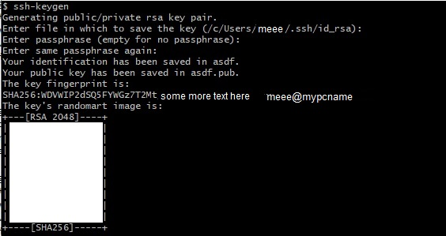

# GT_Cloud_Computing_Documentation Homework

## Georgia Tech Cyber Security Cloud Network Diagram and Documentation Homework

---

## Getting Started with Cloud Computing

### Table of Contents

[Prerequisites](#Prerequisites)
[Step 1 Cloud Setup](#Step1)
[Step 2 Cloud Configuration](#Step2)

## Cloud Computing is becoming more and more of a necessary tool set for many companies, Cloud Computing has opened many gates to make more resources readily available and more accessible then ever before. Along with these it has also opened more attack vectors for criminals and other hacktivist groups, while cloud computing is a revolutionary idea you must weight your risks and accurately judge the added risks that come with it. All the major Cloud Computing companies such as Azure, Google, and Amazon come with the basic toolsets to help harden and protect your systems if used correctly and managed thoroughly. In this documentation I will run you through the basics of cloud computing in a Microsoft Azure cloud environment, and some ways on how to help prevent attacks against your cloud VMs with basic cloud security  

---  
  

  
### The cloud isn't anything new either it has been around for a long time, it has just become more viable in the past decade with the ease of use and configuration. Now anyone can easily utilize cloud computing in todays era  
  
>Cloud computing is really a no-brainer for any start-up because it allows you to test your business plan very quickly for little money. Every start-up, or even a division within a company that has an idea for something new, should be figuring out how to use cloud computing in its plan. Brad Jefferson, Animoto CEO. 2009.  

---  

## Prerequisites  

1. Understanding of basic computer systems (How to operate and use a machine, firewall basics (Allow/Deny rule sets))
2. An Azure account & payment plan if you wish to follow along during the deployment(s)
3. If you are on Linux or Mac you're find but if you're on windows you can use almost any type of unix based terminal environment emulator, my favorite is: [GitBash]( https://git-scm.com/downloads) which comes as a separate download with the Git scm client, simply click to install GitBash when prompted through the Git Install. [Install Guide](https://www.educative.io/edpresso/how-to-install-git-bash-in-windows)
4. A solid network connection is required since everything we will be doing is over the network via HTTP and SSH protocalls (We will go over these in later examples)
5. Terminology

- VM - Virtual Machine
- VNet - Virtual Network
- VPN - Virtual Private Network
- NSG - Network Security Group
- SSH - Secure Shell Protocol

---

# Step 1 Cloud Setup   

> In these steps we will be creating our resources and configuring them after we have everything created and running in [Step 2 Cloud Configuration](#Step2)

## First Things first, double check you have an azure account with a payment option selected that allows your to add resources to your Azure Portal located here: [Go to your Azure Portal](https://portal.azure.com/). If you can see this

then you are good to go!  

### Adding a Resource Group  

>We are going to add a resource group to house our VMs and other resources that our VMs need for our first deployments. This will make it easier to find and manage our resources later

- Under the [Home Portal](https://portal.azure.com/#home) first click on the *Resource groups* button if you do not see it in the top like mine you can click on top search bar that reads: *Search resources, services, and docs (G+/)* and start typing in *Resource groups* and it will pop up.
- Next Click on  to add a new resource group
- Now enter the name of the of your resouce group in the Resource group name field
- Finally Select your Region you will be deploying do, since I live in Alabama and targeting the east region I will select (US) East US as my region.
- Click on  to review your new region group
- If everything has worked correctly you will see  then you are ready to click the  button
- You can validate everything has worked correctly with the Resource Group Created Successfully popup that will be prompted afterwards
- Gif Tutorial 

### Adding a Network Security Group  

>We wull be adding a NSG to help protect our VMs from web traffic, this functions similar to a firewall where we can configure and tell it what type of traffic to allow or deny based off of rulesets we give

- To make a new NSG first head to the [Home Portal](https://portal.azure.com/#home) click on the *Network security groups* button if you do not see it in the top like mine you can click on top search bar that reads: *Search resources, services, and docs (G+/)* and start typing in *Network security groups* and it will pop up.
- Next Click on  to add a new resource group
- Now select your Resource Group you've just created so it will be housed under that specific group, which will make it easier to find to manage later incase you make multiple NSGs
- Now enter the name of the of your NSG in the Network security group
- Select the same region you selected for your resource group name field
- Click on  to review your new region group
- If everything has worked correctly you will see  then you are ready to click the  button
- You can validate everything has worked correctly with the Resource Group Created Successfully popup that will be prompted afterwards
- Gif Tutorial 

### Adding a Virtual Network  

>We will be creating a virtual network for our machines to be able to communicate through, this will be a VPN (Virtual Private Network). This means that only the machines on that network will be able to talk to each other because of the way we have configured our NSGs to only allow internal traffic between VMs

- First from [Home Portal](https://portal.azure.com/#home) select *Virtual network*
- Next Click on  to add a new resource group
- Now select your Resource Group you've just created so it will be housed under that specific group, which will make it easier to find to manage later incase you make multiple VNets
- Now enter the name of the of your VNet in the Virtual network name field
- Select the same region you selected for your resource group
- Click on  to review your new region group
- If everything has worked correctly you will see  then you are ready to click the  button
- You can validate everything has worked correctly with the Resource Group Created Successfully popup that will be prompted afterwards
- Gif Tutorial   

### Adding a JumpBoxProvisioner Virtual Machine  

>The first machine we are going to make will be a jumpbox machine that we will utilize as the administrator machine, this will be a close off machine that will allow only us to access the other VMs inside of our virtual need

- To make a new VM first start from [Home Portal](https://portal.azure.com/#home) and click on the *Virtual machines* button if you do not see it in the top like mine you can click on top search bar that reads: *Search resources, services, and docs (G+/)* and start typing in *Virtual machines* and it will pop up.
- Next Click on  to add a new resource group
- Now select your Resource Group you've just created so it will be housed under that specific group, which will make it easier to find to manage later incase you make multiple VMs
- Fillout the following options like so:
  - Virtual machine name - *JumpBoxProvisioner*
  - Region - same as the resource group

 >(In the Example GIF I slected US East 2 because my free trial is maxed out on the CPUs I can have in the (US) East US)

- Avaliability opions - *No infrastructure redundancy required*
- Image - *Ubuntu Server 18.04 LTS -Gen1* (or the latest LTS at the time of reading this document)
- Size - *Standard_B1ms - 1 vcpu, 2 GiB memory* (Note you might have to search and change the filters to find it)
- Authentication type - *SSH public key*
- Username - *azureuser* (If you choose something different you will have to rememeber it and use it, since I will be refering to azureuser from this point foward)
- SSH public key source - *Use existing public key*

## How to generate a SSH key

  1. Launch GitBash/Terminal on your system
  2. Type in the following command
  `ssh-keygen`
  3. simply press enter for all of the options until you finish which will look like so:
  
  4. How to print your public SSH key, paste the following command into your Gitbash/Terminal
  `cat ~/.ssh/id_rsa.pub`
  5. Copy the following message all the way from ssh-rsa to the end of the last line
  6. Back in your Azure portal post your public SSH key into the SSH public key entry, it will tell if you have done something wrong with the SSH keygen at this time

- Public inbound ports - None
- Next head to the *Networking* tab and set the following configurations
  - Virtual network - Select your VNet you made earlier (If nothing is showing up make sure you have the correct Resource group selected)
  - Public IP - Click on *Create new* and select the following configurations
    - Select Static IP
  - NIC Network security group - Advanced
  - Under the new new Popup Configure network security group select the NSG you created earlier
- Click on  to review your new region group
- If everything has worked correctly you will see  then you are ready to click the  button
- You can validate everything has worked correctly with the Resource Group Created Successfully popup that will be prompted afterwards
- Gif Tutorial   

> Congrats you have finally set up your first Virtual Machine in a cloud environment and have successfully finished Part 1 Cloud Setup  

# Step 2 Cloud Configuration   

>In this step we will be configuring all of the new resources we have created above in [Step 1 Cloud Setup](#Step1)

### NSG Configuration   

- From the [Home Portal](https://portal.azure.com/#home) navigate to *Resource Groups*
- Next Navigate to your newly created Resource group
- Now click on youe *JumpBoxProvisoner* VM
- Copy your Public IP listed on the right side you will need it later
- Where your public ip is  
  

- Back at the [Home Portal](https://portal.azure.com/#home) navigate to *Resource Groups*
- Next Navigate to your newly created Resource group
- Select your NSG you created
- On the right side click on *Inbound security rules*
- Next navigate to this website to figure out your public IP of your network [https://ip.me](https://ip.me/) and copy it, you will need it in a second
- Back in your Azure portal click the  button
- Configure with the following Parameters:
  - Source: IP Addresses
  - Source IP addresses/CIDR ranges: The public IP you copied from earlier (This allows only your public IP to have access into the network, which helps to protect it)
  - Source port ranges: 22
  - Destination: IP Addresses
  - Destination IP addresses/CIDR ranges: (Your Jumpbox VM's public IP)
  - Service: SSH
  - Destination port ranges: 22
  - Protocall: TCP
  - Action: Allow
  - Priority: 3000
  - Name: Jumpbox_Inbound_SSH_Ruleset
- Click on Add
- You can validate everything has worked correctly with the Resource Group Created Successfully popup that will be prompted afterwards
- Gif Tutorial  NEEDS RECORDED  

### Connecting to your new VM   

>Now that we have our VM and NSG set up we can now connect to it through SSH which you can find more information [here](https://en.wikipedia.org/wiki/Secure_Shell_Protocol)

- If you don't have your Machine's Public IP copied down you can find it again here:
  - From the [Home Portal](https://portal.azure.com/#home) navigate to *Resource Groups*
  - Next Navigate to your newly created Resource group
  - Now click on youe *JumpBoxProvisoner* VM
  - Copy your Public IP listed on the right side you will need it later
  - Where your public ip is  
   
- Next Start by opening your Terminal or Gitbash depending on your system
- Then type in
`ssh azureuser@YOUR_VMs_PUBLIC_IP_ADDRESS`
- If the connection times out head back to: [NSG Configuration](#NSGConfig) and double check the configuration to verify it is correct
- It will ask you to allow the thumbprint hash, type in *yes* and press enter
- If you see the left side of the Terminal change to `azureuser@YOUR_VMs_PUBLIC_IP_ADDRESS $` then you are all set to continue to the next step  

### Setting up an Ansible Container

>First we will be creating an Ansible container that will deploy container images to our VMs for easy configuration and quick deployment

- If you haven't connect to your new jumpbox machine do so now here: [Connecting to your new VM](#ConnectToVM)
- Once connected execute these terminal commands to update and upgrade our VMs Linux Packages

`sudo apt-get update`
`sudo apt-get upgrade -y`

- After it has finished we can start installing our software with the following commands

- First we install Docker
`sudo apt install docker.io`
- Next we can verify the service is running with the following command
`sudo systemctl status docker`

- Finally we can install our Ansible service
`sudo docker pull cyberxsecurity/ansible`
`sudo docker run -ti cyberxsecurity/ansible:latest bash`

- To Leave the ansible container you can type in `exit` to leave

- In order to reconnect you can run the following commands 

- First double check there is a service running with
`sudo docker container list -a`

- If it isn't running you can start the container with
`sudo docker start <container_name>`

- If your container is already running you can join it with
`sudo docker attach <container_name>`

### Generating Ansible SSH key 

>Now that we have our Ansible container created we can set up our VPN connection between our Web VMs we will be creating next, first lets generate a new SSH key that will allow only our Jumpbox machine to connect to the WebVMs through a virtual private network

- First make sure you're attached to the docker container, if so your username will say `root@<SomeCrazyNameHere>$`. If you can see this than you are good if not follow the directions here: [Reconnect To Ansible Container](#ReconnectAnsible)

- Next you can run the following two commands to generate the SSH key and copy it out to the terminal
 `ssh-keygen`
- Press enter for all of the options until you finish which will look like so:
  
- Run this command to print out your public key and copy it down somewhere so we can use it for the next step
  `cat ~/.ssh/id_rsa.pub`

### Adding Web Server VMs

>Now that we have connected to our machine and understand basic configuration, we can now continue to add our Web VMs that our Web Portals will run on

- First from [Home Portal](https://portal.azure.com/#home) select *Virtual machines*
- Next Click on  to add a new Virtual Machine
- Now select your Resource Group you've just created so it will be housed under that specific group, which will make it easier to find to manage later incase you make multiple VMs
- Fillout the following options like so:
- Select the following Configurations
  - Virtual machine name - *Web_1*
  - Region - same as the resource group

 >(In the Example GIF I slected US East 2 because my free trial is maxed out on the CPUs I can have in the (US) East US)

- Avaliability opions - *Avalibility Set*
- Avaliability set - *Create new*

#### Create avaliability set

    - Name: *WebServer_Availibilty_Set*

- Image - *Ubuntu Server 18.04 LTS -Gen1* (or the latest LTS at the time of reading this document)
- Size - *Standard_B2s - 2 vcpu, 4 GiB memory* (Note you might have to search and change the filters to find it)
- Authentication type - *SSH public key*
- Username - *azureuser* (If you choose something different you will have to rememeber it and use it, since I will be refering to azureuser from this point foward)
- SSH public key source - *Use your key you generated here in the Ansible SSH Key Setup* [Generating Ansible SSH key](#AnsibleContainerSSH)
- Public inbound ports - None
- Swap to the *Networking* tab and set the following configurations
  - Virtual network - Select your VNet you made earlier (If nothing is showing up make sure you have the correct Resource group selected)
  - Public IP - None
  - NIC Network security group - Advanced
  - Under the new new Popup Configure network security group select the NSG you created earlier

#### Now Follow the same steps for adding a web server vms 2 more times and name the machines *Web_2* and *Web_3*

### Adding NSG Ruleset to access web vms from Ansible container

>From inside of your NSG we will add more inbound rules like we did in [NSG Configuration](#NSGConfig)

- Under the inbound rulesets add a new inbound rule with the following parameters
  - Source: IP Addresses
  - Source IP addresses/CIDR ranges: The public IP of your Jumpbox machine as found here [Connecting to your new VM](#ConnectToVM")
  - Source port ranges: 22
  - Destination: VirtualNetwork
  - Service: SSH
  - Destination port ranges: 22
  - Protocall: TCP
  - Action: Allow
  - Priority: 3100
  - Name: VPN_SSH_Rulset
- Click on Add
- You can validate everything has worked correctly with the Resource Group Created Successfully popup that will be prompted afterwards
- Finally in your Ansible Container you should be able to SSH into the Web vms with `ssh azureuser@<WEB_VMs_IP_ADDRESS>` which can be found here in the VMs config page

